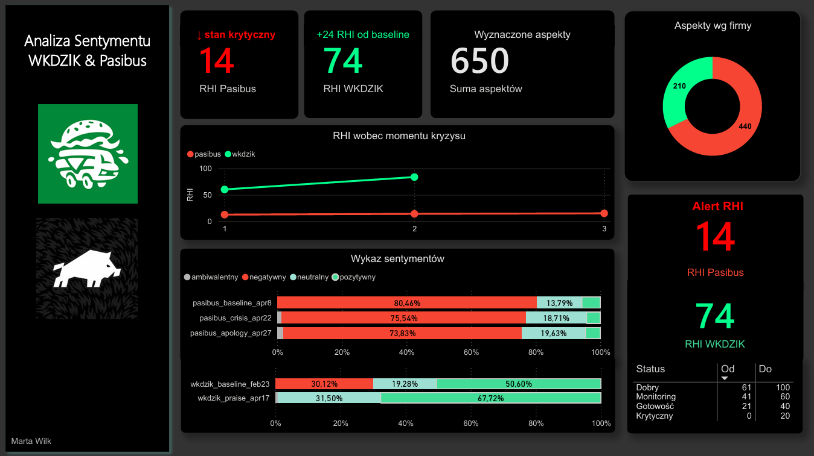

# EN | Sentiment Analysis FB: Pasibus vs WK Dzik — Latwogang Charity Live Case Study
Sentiment analysis of two Polish brands during the crisis vs. image enhancement on social media (using Facebook as an example), conducted using AspektEmo and Power BI.

Context:
---
Starting on April 17 2026, a high-profile charity campaign organized by YouTube creator Łatwogang was underway. The charity campaign for the Cancer Fighters foundation took the form of a live stream on YouTube. During the broadcast, donations from two brands; WKDZIK and Pasibus were widely discussed in the Polish media. Pasibusa faced a serious PR crisis after attempting to persuade singer Doda, who was present during the live stream, to perform at a concert if they made a donation. Viewers criticized the company, and even after Pasibusa donated a larger sum, they continued to comment negatively on the company’s actions. In contrast, WK Dzik won the favor of internet users after donating 5 million zlotys without attaching any conditions. The project tracks sentiment toward both brands before the crisis, during it, and (in the case of Pasibus) after the apology was published.

Questions Before the Analysis
-
1. What was the baseline sentiment toward both brands before the crisis?
2. How did sentiment change during the crisis—did negative or positive engagement dominate?
3. How intense was the negative sentiment toward Pasibus?
4. Did Pasibus’s apology improve their image on social media?

Data collection
-
Data was manually collected from Facebook comment sections using browser console scraping (access to the Meta API required permissions not available to a developer account). A separate account was created for data collection to avoid the influence of prior engagement on content selection by the algorithm. Each dataset contains approximately 100 comments. The raw data was exported as .json files, cleaned, and combined into a single table named ‘sentiment_master’.

| # | Brand | Post | Period |
|---|-------|------|--------|
| 1 | Pasibus | Baseline post | Apr 8, 2026 |
| 2 | Pasibus | Crisis post | Apr 22, 2026 |
| 3 | Pasibus | Apology post | Apr 27, 2026 |
| 4 | WK Dzik | Baseline post | Feb 23, 2026 |
| 5 | WK Dzik | Praise post | Apr 17, 2026 |

Sentiment Analysis
-
The comments were annotated using the AspektEmo tool—a Polish system for aspect-based sentiment analysis developed by CLARIN-PL. Each comment was broken down into aspects (specific topics or subjects), with one of four sentiment categories assigned to each.

| Label | Meaning |
|-------|---------|
| `pozytywny` | positive |
| `negatywny` | negative |
| `neutralny` | neutral |
| `ambiwalentny` | ambivalent |

Reputation Health Index (RHI)
-
To compare sentiment across posts and brands, I developed my own metric—the **Reputation Health Index (RHI)**. Each sentiment category is weighted according to its impact on brand image, and the result is expressed on a scale of 0–100:
 
```
RHI = (positive × 1.0 + neutral × 0.5 + ambivalent × 0.3) / sum of aspects × 100
```
 
For the purposes of this study, a score of **61–100** indicates a healthy image. Scores below **40** signal a reputation crisis.

Result
-
**Pasibus**
- Even the baseline showed strongly negative sentiment (~80% negative aspects). This is a known limitation of the study: the selected baseline post was too recent, and the comments had already been dominated by sentiment related to the scandal.
- Sentiment did not improve after the apology—RHI remained at a critical level, suggesting that the apology did not restore trust in the short term.
- An interesting direction for the future: *How long does a brand need to rebuild its image after a social media crisis?*
**WK Dzik**
- The baseline sentiment was mixed but moderately positive (~50% positive aspects).
- Following a wave of positive reactions to the charity campaign for Cancer Fighters, positive aspects rose to ~68%, and the RHI increased by 24 points—a measurable jump in reputation.

Dashboard
---

Built in **Power BI**. Key visuals:
- RHI KPI cards per brand
- RHI trend line across crisis stages (baseline → crisis/praise → apology)
- Stacked bar chart of sentiment distribution per post
- Aspect breakdown by brand (donut chart)
- RHI status table with threshold ranges


Looking ahead
-
- Pasibus's original post was too close to the moment the scandal broke,
- Only Facebook — expansion to the rest of Meta and TikTok,
- AspektEmo is optimized for the Polish language; slang and irony may be misclassified — optimization by AI in the future?

Tools
-
 
| Tools | Use |
|------|------|
| AspektEmo (CLARIN-PL) | Aspect-based sentiment annotation |
| Python | Data collection |
| Power BI | Dashboard & DAX measures |
| Power Query | Data transformation |
| JSON | Raw data storage |
| Claude | Optimization |

# PL | Analiza Sentymentu FB: Pasibus vs WK Dzik — Case Study Latwogang Live Charytatywny
Analiza sentymentu dwóch polskich marek w trakcie kryzysu vs. wzmocnienia wizerunkowego w mediach społecznościowych (na przykładzie platformy Facebook), zrealizowana przy użyciu AspektEmo i Power BI.

Kontekst:
---
Od 17 kwietnia 2026 roku trwała głośna akcja charytatywna, organizowana przez twórcę na YT - Łatwoganga. Akcja charytatywna dla fundacji Cancer Fighters miała formę live na YT. Podczas transmisji wpłaty dwóch marek były szeroko komentowane w polskich mediach; WKDZIK i Pasibusa. Pasibus zaliczył poważny kryzys wizerunkowy, po próbie namówienia obecnej na live'a piosenkarki Dody do zaśpiewania na koncercie, jeśli wpłacą datek. Oglądający krytykowali firmę i nawet po wpłacie przez Pasibusa większej sumy, nie przestali negatywnie komentować działania firmy. Z kolei, WK Dzik zyskał sympatię internautów, po tym jak wpłacił 5 mln złotych, bez stawiania żadnych warunków. Projekt śledzi, jaki był sentyment wobec obu marek przed kryzysem, w jego trakcie oraz (w przypadku Pasibusa) po opublikowaniu przeprosin.

Pytania przed analizą
-
1. Jaki był bazowy sentyment wobec obu marek przed kryzysem?
2. Jak zmienił się sentyment w trakcie kryzysu — czy dominowało zaangażowanie negatywne czy pozytywne?
3. Jakie było nasilenie negatywnego sentymentu wobec Pasibusa?
4. Czy przeprosiny Pasibusa poprawiły ich wizerunek w mediach społecznościowych?

Zbieranie danych
-
Dane zebrano ręcznie z sekcji komentarzy na Facebooku przy użyciu scrapingu przez konsolę przeglądarki (dostęp do Meta API wymagał uprawnień niedostępnych dla konta deweloperskiego). Do zbierania danych założono osobne konto, aby uniknąć wpływu wcześniejszego zaangażowania na dobór treści przez algorytm. Każdy zbiór danych zawiera około 100 komentarzy. Surowe dane zostały wyeksportowane jako pliki .json, oczyszczone i połączone w jedną tabelę 'sentiment_master'.
| # | Marka | Post | Data |
|---|-------|------|--------|
| 1 | Pasibus | Baseline post | Apr 8, 2026 |
| 2 | Pasibus | Crisis post | Apr 22, 2026 |
| 3 | Pasibus | Apology post | Apr 27, 2026 |
| 4 | WK Dzik | Baseline post | Feb 23, 2026 |
| 5 | WK Dzik | Praise post | Apr 17, 2026 |

Analiza sentymentu
-
Komentarze poddano anotacji przy użyciu narzędzia AspektEmo — polskiego systemu do aspektowej analizy sentymentu opracowanego przez CLARIN-PL. Każdy komentarz został rozłożony na aspekty (konkretne tematy lub podmioty), z przypisaną jedną z czterech kategorii sentymentu.

| Sentyment | 
|-------|
| `pozytywny` |
| `negatywny` | 
| `neutralny` | 
| `ambiwalentny` | 

Reputation Health Index (RHI)
-
W celu porównania sentymentu między postami i markami opracowałam własną miarę — **Reputation Health Index (RHI)**. Każda kategoria sentymentu jest ważona według jej wpływu na wizerunek, a wynik wyrażony w skali 0–100:
 
```
RHI = (pozytywny × 1,0 + neutralny × 0,5 + ambiwalentny × 0,3) / suma aspektów × 100
```
 
Na potrzeby tego badania wynik **61–100** oznacza dobry stan wizerunku. Wyniki poniżej **40** sygnalizują kryzys reputacyjny.

Wynik
-
**Pasibus**
- Już baseline wykazał silnie negatywny sentyment (~80% negatywnych aspektów). To znane ograniczenie badania: wybrany post bazowy był zbyt świeży i komentarze zdążyły już zostać zdominowane przez nastroje związane z aferą.
- Sentyment nie poprawił się po przeprosinach — RHI pozostał na poziomie krytycznym, co sugeruje, że przeprosiny nie odbudowały zaufania w krótkim czasie.
- Interesujący kierunek na przyszłość: *ile czasu potrzebuje marka na odbudowanie wizerunku po kryzysie w mediach społecznościowych?*
**WK Dzik**
- Bazowy sentyment był mieszany, ale umiarkowanie pozytywny (~50% pozytywnych aspektów).
- Po fali pozytywnych reakcji na akcję charytatywną dla Cancer Fighters pozytywne aspekty wzrosły do ~68%, a RHI podniósł się o 24 punkty — mierzalny skok reputacyjny.

Dashboard
---

Opracowano w **Power BI**. Najważniejsze elementy wizualne:
- Karty KPI z RHI dla poszczególnych marek,
- Linia trendu RHI na poszczególnych etapach kryzysu (poziom bazowy → kryzys/pochwały → przeprosiny),
- Wykres słupkowy warstwowy przedstawiający rozkład nastrojów w poszczególnych postach,
- Podział według aspektów dla poszczególnych marek (wykres pierścieniowy),
- Tabela statusów RHI z przedziałami progowymi.


Na przyszłość
-
- Post bazowy Pasibusa był zbyt bliski momentowi wybuchu afery,
- Tylko Facebook — rozszerzenie na resztę Mety i TikToka,
- AspektEmo jest zoptymalizowany pod język polski; slang i ironia mogą być błędnie klasyfikowane - optymalizowanie przez AI na przyszłość?

Narzędzia
-
 
| Narzędzia | Użycie |
|------|------|
| AspektEmo (CLARIN-PL) | Aspect-based sentiment annotation |
| Python | Data collection |
| Power BI | Dashboard & DAX measures |
| Power Query | Data transformation |
| JSON | Raw data storage |
| Claude | Optimization |

**Marta Wilk** 
 

